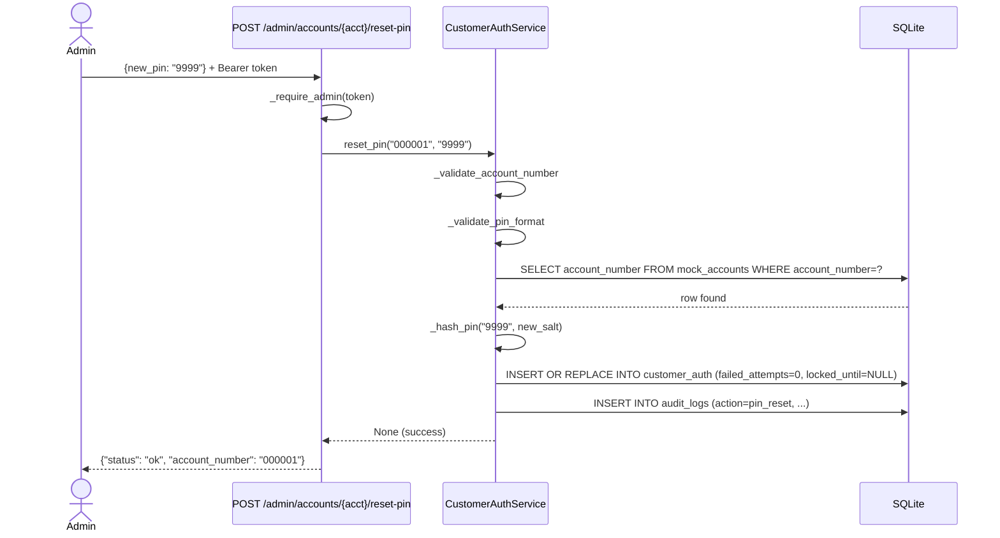
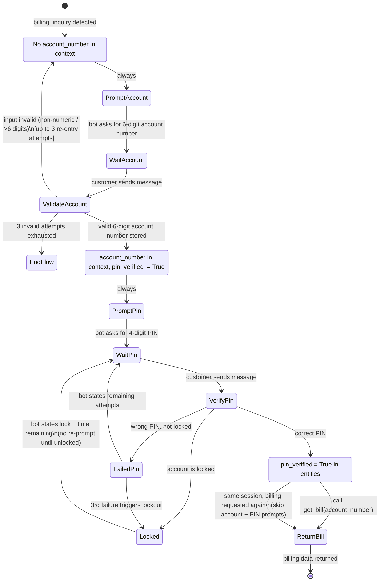

# Design Document: customer-pin-auth

## Overview

This feature adds customer-level PIN authentication to the Kabwe Water agentic AI Customer Service chatbot.
Currently any caller can retrieve billing data for any account number without proving ownership.
This design closes that gap by introducing a 4-digit PIN per account, a dedicated `customer_auth`
SQLite table, a conversational PIN verification gate inside `BillingAgent`, account lockout after
3 consecutive failures, an admin-only PIN reset endpoint, and a migration of the three existing
demo accounts to zero-padded 6-digit account numbers with seeded PINs.

The implementation mirrors the existing admin authentication pattern in `backend/auth.py`
(PBKDF2-SHA256, salted, `hmac.compare_digest`) and integrates into the `BillingAgent` conversation
flow in `backend/orchestrator.py` and `backend/agent.py` without affecting any other agent flows.

### Design Goals

- **Security**: PINs are never stored in plaintext; brute-force is blocked by lockout.
- **Consistency**: `CustomerAuthService` mirrors `AuthService` in structure and naming.
- **Minimal footprint**: Changes are confined to `customer_auth.py` (new), `storage.py`, `agent.py`, and `main.py`.
- **Testability**: Pure functions in `CustomerAuthService` are property-testable with Hypothesis.

---

## Architecture

### Component Diagram

```mermaid
graph TD
    subgraph Web UI
        USER[Customer Message]
    end

    subgraph FastAPI main.py
        CHAT[POST /chat]
        RESET[POST /admin/accounts/{acct}/reset-pin]
    end

    subgraph backend/orchestrator.py
        ORCH[Orchestrator.process]
        BILLING[BillingAgent.handle]
    end

    subgraph backend/agent.py
        RUN[run_agent - billing_inquiry branch]
    end

    subgraph backend/customer_auth.py  NEW
        CAS[CustomerAuthService]
        SET_PIN[set_pin]
        VERIFY[verify_pin]
        RESET_PIN[reset_pin]
    end

    subgraph backend/storage.py
        INIT[init_db]
        SEED[_seed_mock_utility_data]
        ACCT_TBL[(mock_accounts)]
        AUTH_TBL[(customer_auth)]
        BILLS_TBL[(mock_bills)]
        PAY_TBL[(mock_payments)]
    end

    subgraph backend/auth.py  EXISTING
        LOG_SEC[_log_security_event]
    end

    USER --> CHAT --> ORCH --> BILLING --> RUN
    RUN -->|verify_pin| CAS
    CAS --> AUTH_TBL
    CAS -->|audit| LOG_SEC
    RESET --> CAS
    CAS --> SET_PIN --> AUTH_TBL
    INIT --> AUTH_TBL
    SEED --> ACCT_TBL
    SEED --> BILLS_TBL
    SEED --> PAY_TBL
    SEED --> CAS
```

### Key Design Decisions

1. **New module `backend/customer_auth.py`** — keeps customer PIN logic separate from admin auth,
   mirrors `AuthService` structure, and avoids circular imports with `storage.py`.
2. **`init_db()` creates `customer_auth`** — guarantees the table exists before any other code runs,
   consistent with how all other tables are managed.
3. **PIN gate lives in `agent.py` `run_agent()`** — the billing branch already owns the
   account-number lookup; inserting the PIN gate there requires the smallest diff and keeps
   `BillingAgent.handle()` in `orchestrator.py` as a thin wrapper.
4. **`pin_verified` stored in `context["entities"]`** — consistent with how `account_number` and
   other billing entities are stored; survives `context_manager.save_context()` calls.

---

## Components and Interfaces

### `backend/customer_auth.py` — `CustomerAuthService`

New module. All public methods validate `account_number` as a non-empty 6-digit decimal string
before touching the database, raising `ValueError` otherwise.

```python
from dataclasses import dataclass
from typing import Optional

@dataclass
class PinVerifyResult:
    success: bool
    locked: bool
    locked_until: Optional[str]   # ISO 8601 UTC, or None
    remaining_attempts: Optional[int]  # None when locked or success

class CustomerAuthService:
    # ── PIN management ──────────────────────────────────────────────────────
    def set_pin(self, account_number: str, pin: str) -> None:
        """Hash and store a PIN for account_number.

        Raises ValueError if:
        - account_number is not exactly 6 decimal digits
        - pin is not exactly 4 decimal digits
        - account_number does not exist in mock_accounts
        Resets failed_attempts=0 and locked_until=NULL on success.
        """

    def verify_pin(self, account_number: str, candidate_pin: str) -> PinVerifyResult:
        """Verify candidate_pin against the stored hash.

        - Uses hmac.compare_digest for constant-time comparison.
        - Increments failed_attempts on failure.
        - Sets locked_until = now+15min when failed_attempts reaches 3.
        - Rejects all attempts (without incrementing) while locked.
        - Resets failed_attempts=0 on success.
        Raises ValueError if account_number is not exactly 6 decimal digits.
        """

    def reset_pin(self, account_number: str, new_pin: str) -> None:
        """Admin-initiated PIN reset. Delegates to set_pin after audit logging.

        Raises ValueError for the same conditions as set_pin.
        Logs a security event via _log_security_event.
        """

    # ── Internal helpers ────────────────────────────────────────────────────
    def _hash_pin(self, pin: str, salt_hex: str) -> str:
        """PBKDF2-SHA256, 260 000 iterations, returns hex digest."""

    def _validate_account_number(self, account_number: str) -> None:
        """Raise ValueError if not exactly 6 decimal digits."""

    def _validate_pin_format(self, pin: str) -> None:
        """Raise ValueError if not exactly 4 decimal digits."""

    def _log_security_event(self, action: str, account_number: str,
                            details: dict) -> None:
        """Reuse auth.py audit pattern: INSERT into audit_logs."""

# Module-level singleton (mirrors auth_service in auth.py)
customer_auth_service = CustomerAuthService()
```

### `backend/storage.py` — changes

| Change | Detail |
|--------|--------|
| `init_db()` | Add `CREATE TABLE IF NOT EXISTS customer_auth (...)` block |
| `_seed_mock_utility_data()` | Rename accounts `"123456"→"000001"` etc.; update FK rows in `mock_bills`, `mock_payments`; call `customer_auth_service.set_pin()` for demo PINs if not already set |
| `next_account_number()` | New helper: `SELECT MAX(CAST(account_number AS INTEGER)) FROM mock_accounts` → increment → zero-pad to 6 digits; raises `ValueError` at `"999999"` |

### `backend/agent.py` — `run_agent()` billing branch

The `billing_inquiry` / `bill_check` sub-branch gains a PIN gate before calling `get_bill`:

```python
# After resolving acct (account number):
from .customer_auth import customer_auth_service

# 1. Zero-pad short numeric inputs
if acct and acct.isdigit() and len(acct) < 6:
    acct = acct.zfill(6)

# 2. Reject invalid format (>6 digits or non-numeric)
if not (acct and re.fullmatch(r"\d{6}", acct)):
    # track re-entry attempts in session
    ...
    return "Please enter a valid 6-digit account number."

# 3. PIN gate
entities = session.get("entities", {})
if not entities.get("pin_verified"):
    candidate = _extract_pin(message)   # 4-digit regex
    if not candidate:
        return "Please enter your 4-digit PIN to access your billing information."
    result = customer_auth_service.verify_pin(acct, candidate)
    if result.locked:
        mins = _minutes_remaining(result.locked_until)
        return f"Your account is temporarily locked. Please try again in {mins} minute(s)."
    if not result.success:
        return (f"Incorrect PIN. You have {result.remaining_attempts} attempt(s) remaining.")
    entities["pin_verified"] = True
    session["entities"] = entities

# 4. Proceed to get_bill (unchanged)
result = get_bill(acct)
...
```

### `main.py` — admin reset endpoint

```python
class ResetPinRequest(BaseModel):
    new_pin: str

@app.post("/admin/accounts/{account_number}/reset-pin")
def admin_reset_pin(
    account_number: str,
    body: ResetPinRequest,
    authorization: str | None = Header(default=None),
):
    _require_admin(authorization)
    from backend.customer_auth import customer_auth_service
    try:
        customer_auth_service.reset_pin(account_number, body.new_pin)
    except ValueError as exc:
        detail = str(exc)
        if "not found" in detail.lower():
            raise HTTPException(status_code=404, detail=detail)
        raise HTTPException(status_code=422, detail=detail)
    return {"status": "ok", "account_number": account_number}
```

---

## Data Models

### `customer_auth` table (new)

```sql
CREATE TABLE IF NOT EXISTS customer_auth (
    account_number  TEXT    PRIMARY KEY,   -- FK → mock_accounts.account_number
    pin_salt        TEXT    NOT NULL,      -- 64-char hex (32 random bytes)
    pin_hash        TEXT    NOT NULL,      -- 64-char hex (PBKDF2-SHA256 digest)
    failed_attempts INTEGER NOT NULL DEFAULT 0,
    locked_until    TEXT                   -- ISO 8601 UTC, NULL when unlocked
);
```

**Notes:**
- `account_number` is the primary key and a logical foreign key to `mock_accounts`. SQLite does not
  enforce FK constraints by default; `CustomerAuthService.set_pin()` validates existence explicitly.
- `pin_salt` and `pin_hash` are hex-encoded so they are plain ASCII and safe in any SQLite TEXT column.
- `locked_until` is `NULL` when the account is not locked; a non-NULL value means the account is
  locked until that UTC timestamp.

### `mock_accounts` table — account number format change

| Old value | New value | Customer |
|-----------|-----------|----------|
| `"123456"` | `"000001"` | CUST-001 Mary Kija |
| `"789012"` | `"000002"` | CUST-002 John Banda |
| `"555666"` | `"000003"` | CUST-003 Aisha Phiri |

All rows in `mock_bills` and `mock_payments` that reference the old account numbers are updated
in the same transaction.

### `PinVerifyResult` dataclass

```python
@dataclass
class PinVerifyResult:
    success: bool
    locked: bool
    locked_until: Optional[str]    # ISO 8601 UTC string, or None
    remaining_attempts: Optional[int]  # 0-2 on failure; None on success or locked
```

### BillingAgent context shape (updated)

```python
context = {
    "user_id": str,
    "entities": {
        "account_number": str | None,   # 6-digit zero-padded
        "pin_verified": bool,           # NEW — True only after CustomerAuthService confirms
        # ... other existing entities
    },
    "active_agent": "billing_agent",
    "flow_started": bool,
    # ...
}
```

### Account number assignment

```python
def next_account_number(conn: sqlite3.Connection) -> str:
    """Return the next zero-padded 6-digit account number.

    Uses MAX(CAST(account_number AS INTEGER)) to find the current maximum,
    increments by 1, and zero-pads to 6 digits.
    Raises ValueError if the result would exceed 999999.
    Must be called inside a transaction to prevent duplicates.
    """
    row = conn.execute(
        "SELECT MAX(CAST(account_number AS INTEGER)) FROM mock_accounts"
    ).fetchone()
    current_max = row[0] or 0
    next_val = current_max + 1
    if next_val > 999_999:
        raise ValueError("Account number space exhausted (max 999999 reached)")
    return f"{next_val:06d}"
```

---

## Sequence Diagrams

### PIN Verification Flow (happy path)

```mermaid
sequenceDiagram
    actor C as Customer
    participant W as WhatsApp/Web
    participant O as Orchestrator
    participant A as agent.py run_agent()
    participant CAS as CustomerAuthService
    participant DB as SQLite

    C->>W: "What is my bill?"
    W->>O: POST /chat {message}
    O->>A: run_agent(billing_inquiry)
    A-->>O: "Please enter your 6-digit account number."
    O-->>C: prompt

    C->>W: "000001"
    W->>O: POST /chat {message}
    O->>A: run_agent(billing_inquiry, acct=000001)
    A-->>O: "Please enter your 4-digit PIN."
    O-->>C: prompt

    C->>W: "1234"
    W->>O: POST /chat {message}
    O->>A: run_agent(billing_inquiry, acct=000001, candidate_pin=1234)
    A->>CAS: verify_pin("000001", "1234")
    CAS->>DB: SELECT pin_salt, pin_hash, failed_attempts, locked_until
    DB-->>CAS: row
    CAS->>CAS: hash candidate; hmac.compare_digest
    CAS->>DB: UPDATE failed_attempts=0, locked_until=NULL
    CAS-->>A: PinVerifyResult(success=True)
    A->>A: entities["pin_verified"] = True
    A->>DB: get_bill("000001")
    DB-->>A: bill data
    A-->>O: billing response
    O-->>C: bill details
```

### PIN Verification Flow (lockout path)

```mermaid
sequenceDiagram
    actor C as Customer
    participant A as agent.py run_agent()
    participant CAS as CustomerAuthService
    participant DB as SQLite

    C->>A: wrong PIN (attempt 1)
    A->>CAS: verify_pin("000001", "0000")
    CAS->>DB: UPDATE failed_attempts=1
    CAS-->>A: PinVerifyResult(success=False, remaining=2)
    A-->>C: "Incorrect PIN. 2 attempts remaining."

    C->>A: wrong PIN (attempt 2)
    A->>CAS: verify_pin("000001", "0000")
    CAS->>DB: UPDATE failed_attempts=2
    CAS-->>A: PinVerifyResult(success=False, remaining=1)
    A-->>C: "Incorrect PIN. 1 attempt remaining."

    C->>A: wrong PIN (attempt 3)
    A->>CAS: verify_pin("000001", "0000")
    CAS->>DB: UPDATE failed_attempts=3, locked_until=now+15min
    CAS-->>A: PinVerifyResult(locked=True, locked_until=...)
    A-->>C: "Account locked. Try again in 15 minute(s)."

    Note over C,DB: 15 minutes pass

    C->>A: correct PIN
    A->>CAS: verify_pin("000001", "1234")
    CAS->>DB: locked_until < now → proceed; UPDATE failed_attempts=0
    CAS-->>A: PinVerifyResult(success=True)
    A-->>C: bill details
```

### Admin PIN Reset Flow



### BillingAgent Conversation State Machine



**State transitions summary:**

| Current state | Trigger | Next state |
|---|---|---|
| No `account_number` in context | billing intent | Prompt for account number |
| Have `account_number`, `pin_verified` absent/False | any message | Prompt for PIN |
| Have `account_number`, `pin_verified` absent/False | 4-digit input | `verify_pin()` |
| `verify_pin` → locked | — | Inform of lock + time remaining |
| `verify_pin` → failure | — | Inform of remaining attempts |
| `verify_pin` → success | — | Set `pin_verified=True`, call `get_bill` |
| `pin_verified=True` | billing intent (same session) | Call `get_bill` directly |
| Context reset | any | Return to "No account_number" state |

---

## Correctness Properties

*A property is a characteristic or behavior that should hold true across all valid executions of a
system — essentially, a formal statement about what the system should do. Properties serve as the
bridge between human-readable specifications and machine-verifiable correctness guarantees.*

**Property reflection (redundancy elimination):**

Before writing the final properties, the following consolidations were made:

- Requirements 3.1 / 5.1 are identical (no account → prompt for account). Merged into Property 1.
- Requirements 3.2 / 5.2 are identical (have account, not verified → prompt for PIN). Merged into Property 2.
- Requirements 3.5 / 4.6 both state "successful verification resets failed_attempts". Merged into Property 5.
- Requirements 3.8 / 5.7 both state "context reset requires re-verification". Merged into Property 3.
- Requirements 5.3 / 5.6 both state "same-session re-request skips PIN". Merged into Property 4.
- Requirements 4.3 and 4.8 are both covered by Property 6 (lockout counter invariant).
- Requirements 6.2 / 6.3 / 8.6 all test "invalid token → 401/403". Merged into Property 10.
- Requirements 2.6 / 8.7 both test input validation (PIN format and account number format). Merged into Properties 8 and 9.
- Requirements 2.4 / 2.8 both describe post-set_pin state. Merged into Property 7.

---

### Property 1: No account number → billing agent prompts for account number

*For any* conversation context that does not contain a valid `account_number` in `entities`,
when a billing intent is processed by `run_agent()`, the returned reply SHALL ask the customer
for their account number and SHALL NOT contain any billing data.

**Validates: Requirements 3.1, 5.1**

---

### Property 2: Unverified session → billing agent prompts for PIN

*For any* conversation context that contains a valid `account_number` in `entities` but does not
have `entities["pin_verified"] == True`, when a billing intent is processed by `run_agent()`,
the returned reply SHALL ask the customer for their PIN and SHALL NOT contain any billing data.

**Validates: Requirements 3.2, 3.7, 5.2**

---

### Property 3: Context reset clears PIN verification

*For any* conversation context where `entities["pin_verified"]` is `True`, after the context is
reset (via `context_manager.reset_context()` or equivalent), the resulting context SHALL NOT
contain `entities["pin_verified"] == True`.

**Validates: Requirements 3.8, 5.7**

---

### Property 4: Verified session returns billing data directly

*For any* conversation context where `entities["pin_verified"] == True` and a valid
`account_number` is present, when a billing intent is processed by `run_agent()`, the returned
reply SHALL contain billing data and SHALL NOT prompt for a PIN.

**Validates: Requirements 3.4, 5.3, 5.6**

---

### Property 5: Successful PIN verification resets failed_attempts

*For any* account in `customer_auth` with `failed_attempts > 0` and an expired or absent
`locked_until`, when `verify_pin()` is called with the correct PIN, the resulting
`customer_auth` row SHALL have `failed_attempts == 0` and `locked_until == NULL`.

**Validates: Requirements 3.5, 4.5, 4.6**

---

### Property 6: Failed PIN verification increments counter; locked account counter is frozen

*For any* unlocked account in `customer_auth` with `failed_attempts == N` (where N < 3),
when `verify_pin()` is called with an incorrect PIN, the resulting row SHALL have
`failed_attempts == N + 1`. Furthermore, *for any* locked account (current UTC time is before
`locked_until`), any number of `verify_pin()` calls SHALL leave `failed_attempts` unchanged.

**Validates: Requirements 4.1, 4.3, 4.8**

---

### Property 7: set_pin is an upsert that resets lockout state

*For any* existing account in `mock_accounts` and *any* valid 4-digit PIN, calling `set_pin()`
twice with different PINs SHALL result in only the second PIN being accepted by `verify_pin()`,
and the `customer_auth` row SHALL have `failed_attempts == 0` and `locked_until == NULL`
after each call.

**Validates: Requirements 2.2, 2.4, 2.8, 4.7**

---

### Property 8: Invalid PIN format is rejected before hashing

*For any* string that is not exactly 4 decimal digit characters (too short, too long, contains
non-digit characters, or is empty), calling `set_pin()` or `verify_pin()` SHALL raise `ValueError`
and SHALL NOT modify the `customer_auth` table.

**Validates: Requirements 2.6, 8.3**

---

### Property 9: Invalid account number format is rejected by all public Auth_Service methods

*For any* string that is not exactly 6 decimal digit characters (too short, too long, contains
non-digit characters, or is empty), calling any public method of `CustomerAuthService`
(`set_pin`, `verify_pin`, `reset_pin`) SHALL raise `ValueError` before performing any
database operation.

**Validates: Requirements 8.7, 2.7**

---

### Property 10: Admin reset endpoint rejects missing or invalid tokens

*For any* HTTP request to `POST /admin/accounts/{account_number}/reset-pin` that carries a
missing, malformed, or expired `Authorization` header, the endpoint SHALL return HTTP 401 or
HTTP 403 and SHALL NOT modify any row in `customer_auth`.

**Validates: Requirements 6.2, 6.3, 8.6**

---

### Property 11: Account number format invariant

*For any* account number produced by `next_account_number()` or stored in `mock_accounts` after
migration, the value SHALL match the regular expression `^[0-9]{6}$` (exactly 6 decimal digits,
zero-padded).

**Validates: Requirements 1.1, 1.2**

---

### Property 12: Short numeric account input is zero-padded by BillingAgent

*For any* numeric string of length 1 to 5 provided by a customer as an account number, the
`run_agent()` billing branch SHALL zero-pad it to 6 digits before performing any lookup, and the
padded value SHALL equal the original numeric value.

**Validates: Requirements 1.5**

---

### Property 13: PIN prompt does not reveal account number

*For any* conversation context containing a valid `account_number`, when `run_agent()` returns
a PIN prompt (state: have account, not verified), the reply text SHALL NOT contain the
`account_number` string.

**Validates: Requirements 8.4**

---

### Property 14: Admin reset audit log is always written

*For any* call to `CustomerAuthService.reset_pin()` — whether it succeeds or raises a
`ValueError` — an entry SHALL be inserted into the `audit_logs` table recording the target
`account_number`, the outcome, and a UTC timestamp.

**Validates: Requirements 6.8**

---

## Error Handling

### `CustomerAuthService` error taxonomy

| Condition | Exception / Response |
|-----------|----------------------|
| `account_number` not exactly 6 decimal digits | `ValueError("account_number must be exactly 6 decimal digits")` |
| `pin` not exactly 4 decimal digits | `ValueError("PIN must be exactly 4 decimal digits")` |
| `account_number` not found in `mock_accounts` | `ValueError("Account {account_number} not found")` |
| No PIN set for account (verify called before set) | `PinVerifyResult(success=False, locked=False, remaining_attempts=3)` — treated as wrong PIN |
| Database error during `set_pin` / `verify_pin` | Propagate `sqlite3.Error`; caller logs and returns a generic error message |

### `BillingAgent` / `run_agent()` error handling

| Condition | Bot reply |
|-----------|-----------|
| Account number input is non-numeric or >6 digits | "Please enter a valid 6-digit account number." (up to 3 re-entry attempts, then end flow) |
| Account number counter exhausted (>999999) | Log error; return "Account creation is temporarily unavailable." |
| `verify_pin` returns locked | "Your account is temporarily locked. Please try again in X minute(s)." |
| `verify_pin` returns failure | "Incorrect PIN. You have X attempt(s) remaining." |
| `get_bill` raises an exception | Existing error handling in `agent.py` applies (unchanged) |

### Admin reset endpoint error handling

| Condition | HTTP status | Body |
|-----------|-------------|------|
| Missing / invalid admin token | 401 / 403 | `{"detail": "..."}` |
| `account_number` not in `mock_accounts` | 404 | `{"detail": "Account {acct} not found"}` |
| `new_pin` not exactly 4 decimal digits | 422 | `{"detail": "PIN must be exactly 4 decimal digits"}` |
| Database error | 500 | `{"detail": "Internal server error"}` |
| Success | 200 | `{"status": "ok", "account_number": "..."}` |

### Migration error handling

The account number migration in `_seed_mock_utility_data()` runs inside a single SQLite
transaction. If any `UPDATE` or `INSERT` fails, the entire transaction is rolled back and the
database is left in its pre-migration state. The error is logged at `ERROR` level and `init_db()`
re-raises the exception so the application fails fast on startup rather than running with
inconsistent data.

---

## Testing Strategy

### Overview

This feature uses a **dual testing approach**: example-based unit tests for specific scenarios
and integration points, and property-based tests (using [Hypothesis](https://hypothesis.readthedocs.io/))
for universal correctness properties. Both are complementary.

**Property-based testing library:** `hypothesis` (already present in the project via `.hypothesis/`
directory). Each property test runs a minimum of **100 iterations**.

**Tag format for property tests:**
```python
# Feature: customer-pin-auth, Property N: <property text>
```

---

### Unit Tests (`tests/test_customer_pin_auth.py`)

Focus on specific examples, integration points, and edge cases.

| Test | What it verifies |
|------|-----------------|
| `test_set_pin_stores_hash_not_plaintext` | The stored `pin_hash` is not equal to the plaintext PIN |
| `test_verify_pin_correct` | Correct PIN returns `success=True` |
| `test_verify_pin_wrong` | Wrong PIN returns `success=False` |
| `test_lockout_after_3_failures` | 3rd failure sets `locked_until` ≈ now+15min |
| `test_locked_account_rejects_correct_pin` | Correct PIN rejected while locked |
| `test_lockout_expires` | After `locked_until` passes, correct PIN succeeds |
| `test_admin_reset_unlocks_account` | `reset_pin()` on locked account clears lock |
| `test_migration_account_numbers` | `"123456"→"000001"` etc. with FK updates |
| `test_demo_pin_seeding` | Demo PINs `"1234"`, `"5678"`, `"9012"` work after `init_db()` |
| `test_demo_pin_not_overwritten` | Re-running `init_db()` does not overwrite changed PINs |
| `test_admin_reset_endpoint_401` | Missing token → HTTP 401 |
| `test_admin_reset_endpoint_404` | Unknown account → HTTP 404 |
| `test_admin_reset_endpoint_422` | Invalid PIN format → HTTP 422 |
| `test_admin_reset_endpoint_200` | Valid request → HTTP 200 + correct body |
| `test_audit_log_on_reset_success` | Audit log entry created on success |
| `test_audit_log_on_reset_failure` | Audit log entry created on validation failure |
| `test_account_number_exhaustion` | `next_account_number()` raises at 999999 |
| `test_pin_prompt_excludes_account_number` | PIN prompt reply does not contain account number |

---

### Property-Based Tests (`tests/test_customer_pin_auth_properties.py`)

Each test maps to a numbered property in the Correctness Properties section.

```python
from hypothesis import given, settings
from hypothesis import strategies as st

# Shared strategies
valid_account = st.from_regex(r"[0-9]{6}", fullmatch=True)
valid_pin     = st.from_regex(r"[0-9]{4}", fullmatch=True)
invalid_pin   = st.text().filter(lambda s: not re.fullmatch(r"[0-9]{4}", s))
invalid_acct  = st.text().filter(lambda s: not re.fullmatch(r"[0-9]{6}", s))
```

| Test | Property | Hypothesis strategy |
|------|----------|---------------------|
| `test_prop1_no_account_prompts_for_account` | Property 1 | Random context without `account_number` |
| `test_prop2_unverified_prompts_for_pin` | Property 2 | Random context with `account_number`, no `pin_verified` |
| `test_prop3_context_reset_clears_pin_verified` | Property 3 | Random context with `pin_verified=True` |
| `test_prop4_verified_session_returns_bill` | Property 4 | Random context with `pin_verified=True` + valid account |
| `test_prop5_success_resets_failed_attempts` | Property 5 | `valid_account`, `valid_pin`, random `failed_attempts` 1-2 |
| `test_prop6_failure_increments_counter` | Property 6 | `valid_account`, wrong PIN, `failed_attempts` 0-2 |
| `test_prop6b_locked_counter_frozen` | Property 6 | `valid_account`, any PIN, locked account |
| `test_prop7_set_pin_upsert` | Property 7 | `valid_account`, two different `valid_pin` values |
| `test_prop8_invalid_pin_rejected` | Property 8 | `invalid_pin` |
| `test_prop9_invalid_account_rejected` | Property 9 | `invalid_acct` |
| `test_prop10_invalid_token_rejected` | Property 10 | Random invalid token strings |
| `test_prop11_account_number_format` | Property 11 | Random starting max values 0-999998 |
| `test_prop12_short_account_zero_padded` | Property 12 | `st.integers(1, 99999)` as short account strings |
| `test_prop13_pin_prompt_no_account_number` | Property 13 | `valid_account`, random context |
| `test_prop14_audit_log_always_written` | Property 14 | `valid_account`, `valid_pin` + `invalid_pin` mix |

**Settings:**
```python
@settings(max_examples=100)
```

---

### Integration / Smoke Tests

| Test | Type | What it verifies |
|------|------|-----------------|
| `test_customer_auth_table_created` | Smoke | `init_db()` creates `customer_auth` with correct columns |
| `test_hmac_compare_digest_used` | Smoke | Code inspection / import check that `hmac.compare_digest` is called |
| `test_pbkdf2_iteration_count` | Smoke | Verify 260,000 iterations in `_hash_pin` |
| `test_no_public_endpoint_exposes_customer_auth` | Smoke | No non-admin route queries `customer_auth` |
| `test_concurrent_account_creation` | Integration | Two concurrent `next_account_number()` calls produce distinct values |
