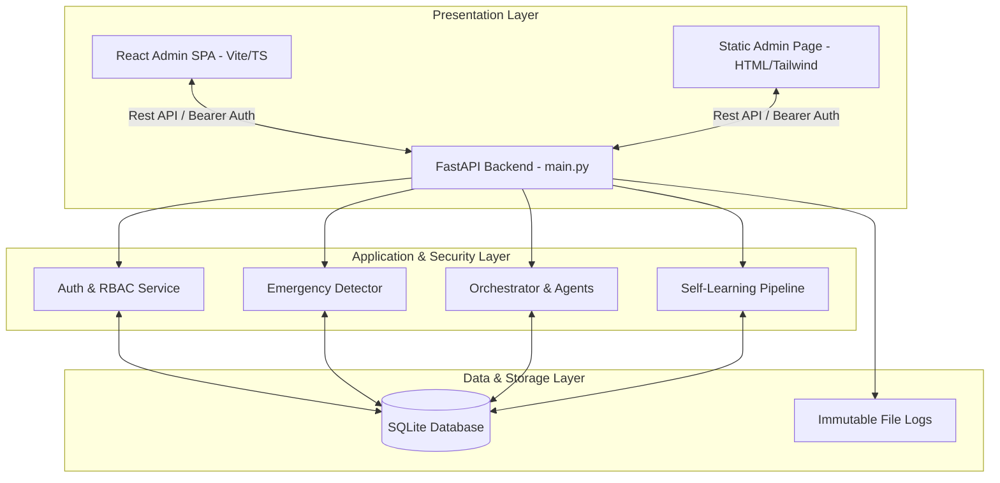
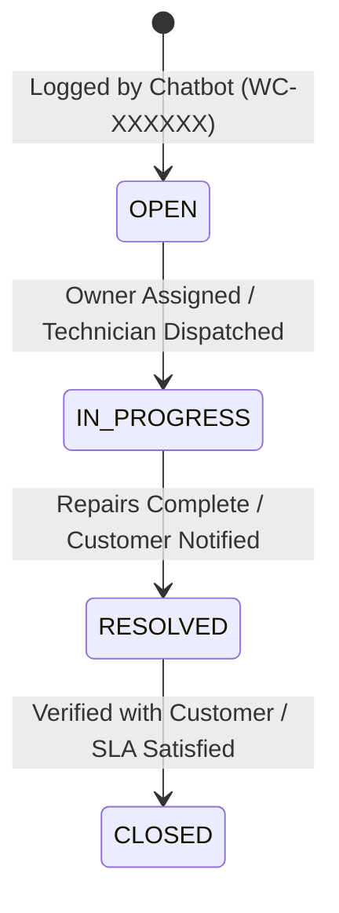

# System Design Specification: LgWSC Admin Dashboard

This document provides a comprehensive system design specification for the **Admin Dashboard** of the Lukanga Water Supply and Sanitation Company (LgWSC) Agentic AI Chatbot system. It details the architecture, visual design system, functional flows, API integrations, and database schemas that govern administrative operations.

---

## 1. System Overview & Architecture

The LgWSC Admin Dashboard is the central administrative and operator cockpit of the customer service automation platform. In an agentic AI system, total autonomy presents risks of hallucinations or incorrect operations. The Admin Dashboard serves as the **Human-in-the-Loop (HITL)** governance layer, allowing operators to monitor system performance, manage customer complaints, resolve live escalations, and audit the AI's self-learning intent pipeline.



### Dual-Frontend Implementation
To provide maximum flexibility for local testing, demonstration, and staging, the dashboard is implemented in two distinct formats:
1. **Standalone Page (`static/admin.html`)**: Served directly by the FastAPI backend at `/admin`. Built using clean, self-contained TailwindCSS and native JavaScript, it includes real-time Chart.js visual tracking. This is optimized for zero-configuration deployments.
2. **Enterprise Client (`frontend/admin`)**: A modern Single Page Application (SPA) built with React, Vite, and TypeScript. Styled with modern, modular UI components, this frontend is optimized for deployment in a cloud container (e.g., Docker/Vercel) connected to the central backend.

---

## 2. Security System & Role-Based Access Control (RBAC)

To align with the **Smart Zambia ICT Policy** and data safety standards, the dashboard implements token-based authentication with granular roles:

### User Roles & Permissions
* **Customer**: Can interact only via the public chat interface. Has no administrative access.
* **Admin**: Access to the operational dashboard, complaint lifecycles, and live escalation chats. Can assign tickets, change status, and add comments.
* **Super Admin**: Full database access. Can manage admin accounts, manage system resolution records, and perform administrative overrides on self-learning AI activations.

### Authentication Flow
1. **Credentials verification**: Operator submits `username` and `password` via `POST /auth/login`.
2. **Token generation**: The backend verifies credentials using PBKDF2 hashing, generates a secure session token hash, and logs the login event.
3. **Session state**: The frontend stores the token in secure browser `localStorage` under `admin_token`.
4. **API Requests Authorization**: For every subsequent request, the dashboard appends the token in the headers:
   ```http
   Authorization: Bearer <admin_token>
   ```
5. **Token Expiration**: Tokens expire after 24 hours. The frontend interceptor detects `HTTP 401 Unauthorized` responses and automatically triggers a safe logout flow, clearing stored user states.

---

## 3. UI/UX Design & Visual Systems

The dashboard employs a **clean, high-density professional aesthetic** designed to maximize operational efficiency. The user interface is built on a responsive multi-column layout optimized for high-resolution desk displays.

### Visual Design Tokens
* **Color Palette**: Curated slate and indigo primary colors representing water and professional administration.
  * Primary Brand Color: Blue-600 (`#2563eb`)
  * Neutral Backgrounds: Gray-50 (`#f9fafc`) / Slate-50 (`#f8fafc`)
  * Text Colors: Slate-800 (`#1e293b`) / Gray-600 (`#475569`)
* **Dynamic Indicators (SLA Priority Colors)**:
  * Emergency/High Priority: Rose Red gradient (`linear-gradient(135deg, #ef4444, #dc2626)`)
  * Medium Priority: Orange gradient (`linear-gradient(135deg, #f97316, #ea580c)`)
  * Normal Priority: Yellow gradient (`linear-gradient(135deg, #eab308, #ca8a04)`)
  * Resolved/Healthy Status: Emerald Green (`#10b981`)
* **Micro-Animations**: Hover-scale states (`.metric-card:hover { transform: translateY(-2px); }`) and loading spinners (`#loginSpinner`) are utilized to keep the interface interactive and highly responsive.

---

## 4. Key Functional Modules & User Flows

```
┌────────────────────────────────────────────────────────────────────────┐
│                              ADMIN DASHBOARD                           │
├────────────────────────────────────────────────────────────────────────┤
│  [Dashboard Home]        [Complaints Management]      [Escalation Queue]│
│  • Total Complaints      • Filterable Tickets         • Inbound Claims  │
│  • Latency & Ratings     • Status Adjuster            • Live Operator   │
│  • Chart.js Analytics    • SLA Due Calculator         • Bot Suppression │
└────────────────────────────────────────────────────────────────────────┘
```

### A. Real-Time Operational Analytics (Dashboard Home)
* **Real-time Metrics**: Aggregate counts pull directly from storage models to display six primary operational indices: Total Complaints, Average Response Latency (ms), Average Satisfaction Rating (Stars), Resolved Counts, Escalations, and Active Sessions.
* **Chart.js Visual Charts**: 
  * *Intents Distribution Bar Chart*: Reflects which issues are reported most frequently, highlighting seasonal trends (e.g., higher leak reports in dry seasons).
  * *Satisfaction Doughnut Chart*: Aggregates customer feedback from 1 to 5 stars to track citizen satisfaction levels.
* **Feedback Activity Log**: Tabulates direct feedback, ensuring that negative customer comments are immediately visible for managerial review.

### B. Complaint Ticket Lifecycle Management
When the AI Chatbot logs a complaint, the ticket enters a state-machine managed in the SQLite database and updated via the Complaints tab:



* **Automated Categorization & SLA**: The AI automatically extracts geographic areas (e.g., Kabwe, Highridge) and assigns a priority rank. Normal priority tickets have a 48-hour SLA window, while emergencies (e.g., massive pipeline bursts) default to immediate urgency (4-hour SLA).
* **Technician Assignment**: Admins dispatch tickets to staff members (`POST /admin/complaints/{id}/assign`).
* **Operational Notes Log**: Internal teams write persistent field logs on the ticket detail page. Every note is stamped with the author's identity and timestamp.

### C. Live Escalation Chat (Human-in-the-Loop Takeover)
The system bridges natural conversation and emergency routing through the **Escalation Module**:
1. **Escalation Trigger**: The AI automatically yields control to a human if:
   * The customer explicitly requests a human agent (`talk to agent`).
   * The intent pipeline classification confidence drops below `0.6`.
   * The emergency detector flags a high-priority hazard.
2. **Agent Notification**: The session status is updated to `WAITING` and populates in the dashboard's Escalation Queue.
3. **Bot Suppression & Intercept**: When the admin opens the Chat interface, the system sets the session's active lock. The AI chatbot is completely suppressed from responding to the customer's phone number.
4. **Bidirectional Communication**: The admin can view historical transcripts and text back and forth. The admin's replies are sent directly to the customer's chat screen (`POST /admin/escalations/{id}/reply`).
5. **Handoff Exit**: When the admin clicks **Close**, the escalation entry updates to `RESOLVED`, the session lock is cleared, and the AI chatbot is safely restored as the primary operator.

### D. AI Governance & Self-Learning (Advanced AI-Ops)
To support system maintenance and intent updates without code changes, the dashboard includes governance endpoints:
* **Intent Suggestions Queue**: Aggregates customer sentences that the chatbot failed to understand.
* **Labeling & Staging**: Admins review, write training labels, and assign a code handler to new intents (`POST /admin/intent_suggestions/{id}/deploy`).
* **Staged Performance Testing**: Evaluates precision, recall, and F1-scores against historical datasets before production deployment (`POST /admin/intent_suggestions/{id}/test`).
* **Supervised Production Activation**: Requires two independent human approvals to activate a staged intent, protecting the customer-facing pipeline from unverified updates.

---

## 5. API Integration Specifications

The admin dashboard relies on these primary FastAPI endpoints:

### Authentication
* `POST /auth/login` - Authenticates user credentials and returns a secure token hash, role, and expiration timestamp.
* `POST /auth/logout` - Revokes the active session token hash.

### Operational Metrics
* `GET /admin/dashboard` - Returns total complaints, average response time, satisfaction, resolution/escalation counts, and categorized intent frequencies.

### Complaint Management
* `GET /admin/complaints` - Retrieves a complete list of complaints.
* `GET /admin/complaints/{ticket_id}` - Gets detailed metrics, geographic area, and internal notes log for a specific ticket.
* `POST /admin/complaints/{ticket_id}/status` - Transitions ticket status (`OPEN`, `IN_PROGRESS`, `RESOLVED`, `CLOSED`).
* `POST /admin/complaints/{ticket_id}/note` - Adds a persistent operator note to a ticket.
* `POST /admin/complaints/{ticket_id}/assign` - Assigns or updates the owner responsible for the ticket.
* `POST /admin/complaints/{ticket_id}/priority` - Updates priority and automatically recomputes the SLA deadline.

### Escalation Chat
* `GET /admin/escalations` - Lists all active and past escalations.
* `GET /admin/escalations/{escalation_id}` - Opens the chat session and pulls full transcripts.
* `POST /admin/escalations/{escalation_id}/reply` - Sends a text response from the operator directly into the customer's chat session.
* `POST /admin/escalations/{escalation_id}/close` - Resolves the escalation, clearing session locks and returning control to the AI bot.

---

## 6. Database Integration Schema

The dashboard aggregates operational data from the following SQLite tables:

### Complaint Management
```sql
CREATE TABLE water_complaints (
    ticket_id TEXT PRIMARY KEY,
    name TEXT NOT NULL,
    phone TEXT NOT NULL,
    area TEXT NOT NULL,
    issue TEXT NOT NULL,
    status TEXT DEFAULT 'OPEN',
    category TEXT,
    priority TEXT DEFAULT 'NORMAL',
    sla_due_at TEXT,
    created_at TEXT NOT NULL,
    updated_at TEXT NOT NULL,
    assigned_to TEXT
);
```

### Conversation Escalation
```sql
CREATE TABLE escalations (
    escalation_id TEXT PRIMARY KEY,
    ticket_id TEXT,
    user_id TEXT NOT NULL,
    reason TEXT NOT NULL,
    status TEXT DEFAULT 'WAITING',
    created_at TEXT NOT NULL,
    updated_at TEXT NOT NULL,
    FOREIGN KEY(ticket_id) REFERENCES water_complaints(ticket_id)
);
```

### Customer Satisfaction (CSAT) Metrics
```sql
CREATE TABLE user_feedback (
    feedback_id TEXT PRIMARY KEY,
    session_id TEXT NOT NULL,
    user_id TEXT NOT NULL,
    rating INTEGER CHECK(rating >= 1 AND rating <= 5),
    text_feedback TEXT,
    helpful INTEGER,
    timestamp TEXT NOT NULL
);
```

---

## 7. Academic Contribution (Capstone Defense Context)

For the **ICT432 Capstone Project** defense under Dr. Brian Halubanza, the design of the Admin Dashboard addresses several critical research questions:

1. **Demonstrates Responsible AI (HITL)**: It validates how the system mitigates the risk of LLM hallucinations. Rather than leaving the AI unmonitored, the dashboard ensures that critical operations (e.g., emergencies or low confidence ratings) are instantly and safely escalated to professional human operators.
2. **Exhibits Advanced Software Engineering (Self-Learning & Testing)**: The integration of the self-learning intent pipeline shows that the system can adapt to changes in vocabulary without manual database migrations or backend redevelopment.
3. **Complies with Public Policy Policies (Data Protection)**: The system automatically masks PII in conversation history tables for analysts, while keeping them visible in verified tables (`conversation_history_pii`) for authorized administrators, directly satisfying the **Smart Zambia Smart Governance Security Standards**.
